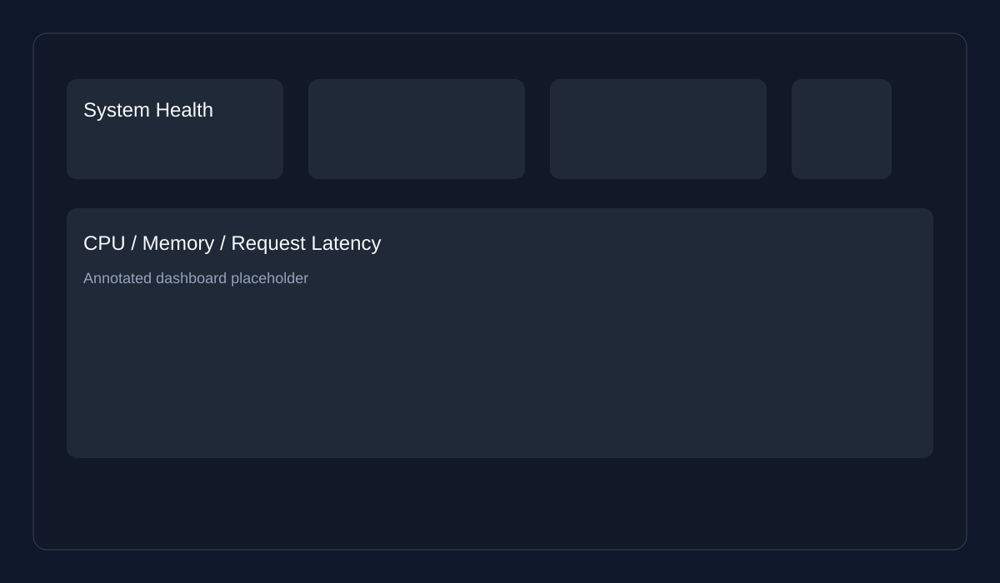
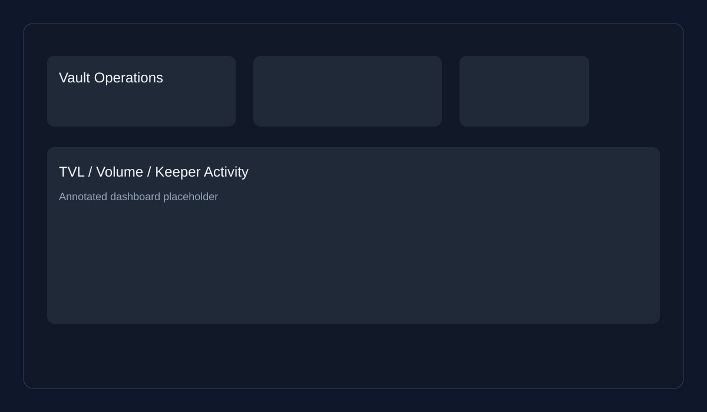
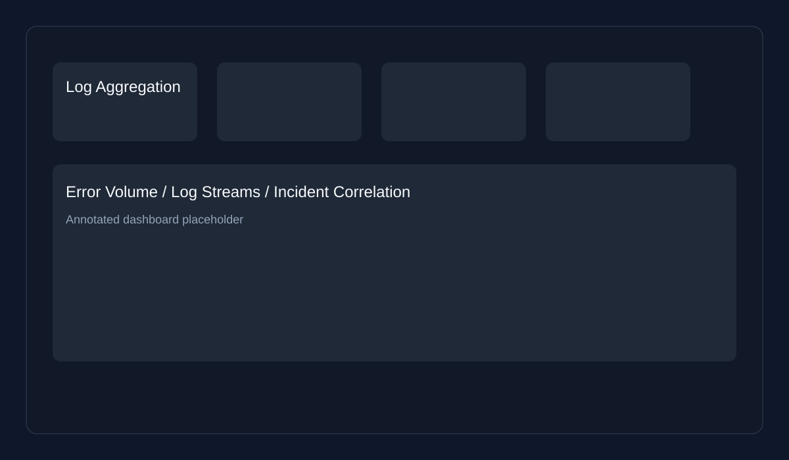

# Grafana Guide

This guide explains the Grafana dashboards that support operations, incident response, and day-to-day monitoring for Aura Vault Protocol.

## Dashboard inventory

The dashboards are exported as JSON and stored in the repository under [monitoring/grafana/dashboards](../monitoring/grafana/dashboards):

- [monitoring/grafana/dashboards/system-health.json](../monitoring/grafana/dashboards/system-health.json)
- [monitoring/grafana/dashboards/vault-operations.json](../monitoring/grafana/dashboards/vault-operations.json)
- [monitoring/grafana/dashboards/log-aggregation.json](../monitoring/grafana/dashboards/log-aggregation.json)

## 1. System Health dashboard

### What it shows

- Service availability and container health across the monitoring stack
- CPU, memory, and disk pressure indicators
- Error rate and request latency trends for the back end

### Normal ranges

- CPU usage: below 70% sustained for 5 minutes
- Memory usage: below 80% of allocated memory
- Error rate: below 1% of requests
- Latency p95: below 400ms for normal traffic

### Alert thresholds

- CPU > 85% for 10 minutes
- Memory > 90% for 5 minutes
- Error rate > 2% for 5 minutes
- Latency p95 > 800ms for 10 minutes

### Drill-down to logs

Click any panel title and choose the related Explore action to jump into Loki logs for the service or deployment that is spiking.

## 2. Vault Operations dashboard

### What it shows

- Vault TVL, daily volume, and deposit/withdraw throughput
- Strategy performance and keeper activity
- Transaction health for the protocol’s main flows

### Normal ranges

- TVL trend: stable or gradually increasing
- Deposit/withdraw rate: within expected daily range
- Keeper activity: at least one successful harvest per expected window

### Alert thresholds

- TVL drop > 20% from baseline over 30 minutes
- Failed transaction ratio > 5%
- Keeper harvest failures > 3 consecutive attempts

### Drill-down to logs

Use the panel context menu to open the related log stream in Explore, then filter by the contract, transaction hash, or operation label.

## 3. Log Aggregation dashboard

### What it shows

- Structured log volume by service and severity
- Recent error patterns and repeated stack traces
- Correlated traces and alerts from the observability stack

### Normal ranges

- Error logs: sparse, with no repeated stack traces
- Warning volume: consistent with expected background noise
- Log ingestion: steady and in line with traffic volume

### Alert thresholds

- Error logs > 50 entries in 5 minutes for a single service
- Repeated `panic` or `exception` patterns in the same time window
- Missing log ingestion for more than 10 minutes

### Drill-down to logs

Open the dashboard panel and choose the log stream or Explore link to inspect the raw entries and correlate them with alerts.

## Dashboard review checklist

Before changing a dashboard:

- [ ] Confirm the panel names, units, and legends are still correct.
- [ ] Verify the alert thresholds match the current runbook.
- [ ] Ensure the dashboard still links to the right log source.
- [ ] Export the updated JSON and commit it with the change.
